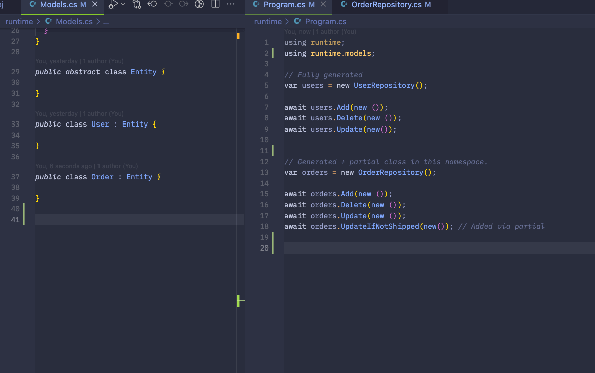

# Source Generation (Roslyn)

C#'s **Roslyn** compiler platform offers powerful APIs for analyzing, compiling, and generating code. With **source generators**, developers can automate code generation at build time, reducing runtime overhead and eliminating repetitive boilerplate. Source generators allow tasks like creating DTOs, custom serialization, or mapping logic to be generated automatically during the compilation process, improving efficiency and ensuring consistency across the application without manual coding.

By generating code at build time, source generators can significantly **improve performance** by offloading tasks from runtime to the build process, reducing runtime overhead. For example, classes or methods for serialization or dependency injection can be generated ahead of time, leaving the application lightweight and fast. This not only reduces boilerplate but also ensures cleaner, more maintainable code, allowing developers to focus on business logic rather than repetitive tasks.

This also enables certain scenarios that are much more difficult to achieve in JS/TS compared to C#.

In this example below, we use Roslyn to generate a `ProductRepository` automatically when we add an entity type `Product`:

## Basics

> 👋🏼 Interested in contributing?
