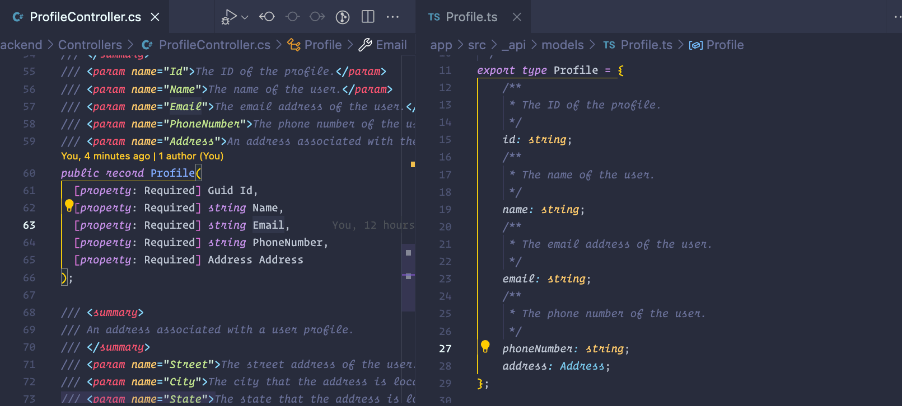

# CLI and Tooling

## Initializing a Project

<CodeSplitter>
  <template #left>

```shell
# TypeScript
# Switch into directory
npm init .
tsc --init .

# Modify tsconfig.json and package.json as necessary

# Use templates
npx create vite .
```

  </template>
  <template #right>

```shell
# .NET
# List the types of projects
dotnet new list

# Create a project using a template
dotnet new webapi
dotnet new console
```

  </template>
</CodeSplitter>

## Building a Project

<CodeSplitter>
  <template #left>

```shell
# TypeScript
# Assuming a script for "build" in package.json
npm run build
```

  </template>
  <template #right>

```shell
# .NET
dotnet build
```

  </template>
</CodeSplitter>

## Hot Reload

<CodeSplitter>
  <template #left>

```shell
# TypeScript
# Assuming the project has been configured with a watcher in package.json
# Assuming the tsconfig.json has watchOptions set up.
npm run build:watch
```

  </template>
  <template #right>

```shell
# .NET
dotnet watch

# To avoid manually confirming "rude edits"
dotnet watch --non-interactive
```

  </template>
</CodeSplitter>

Check it out in action here as we generate OpenAPI bindings on save:



Learn more about build-watch:

- [TypeScript build-watch](https://www.typescriptlang.org/docs/handbook/configuring-watch.html)
- [dotnet watch](https://learn.microsoft.com/en-us/dotnet/core/tools/dotnet-watch)

## Adding Packages

<CodeSplitter>
  <template #left>

```shell
# TypeScript

# Local package is set up via package manager and config files.

# Remote package
yarn add some-package
yarn add -D some-package

npm install some-package
npm install --save-dev some-package
```

  </template>
  <template #right>

```shell
# .NET

# Local package
dotnet add reference ../other-project/my-other-project.csproj

# Remote package
dotnet add package SomeRemotePackage
```

  </template>
</CodeSplitter>

Generally, workspace management for local package references requires configuration based on the package manager selected

- [Yarn](https://yarnpkg.com/features/workspaces),
- [NPM](https://docs.npmjs.com/cli/v7/using-npm/workspaces),
- [pnpm](https://pnpm.io/workspaces)
