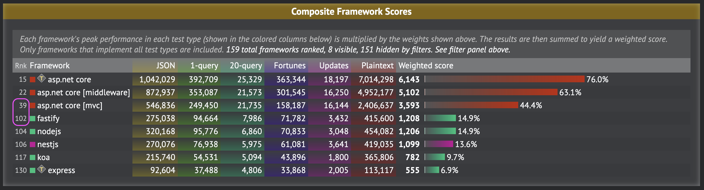

# Nest.js vs Controller API

**Nest.js** builds on top of Express (or optionally Fastify) and introduces a **structured, modular architecture** with features like **decorator-based routing, dependency injection (DI), and controllers**, making it more comparable to **.NET Controller APIs** than plain Express.js. By enforcing a convention-driven approach similar to ASP.NET Core, Nest.js simplifies the development of scalable applications while integrating well with TypeScript’s strong typing. Its use of decorators for defining routes and DI for managing services closely resembles the approach used in .NET, making it feel more structured and maintainable than raw Express.

However, **Nest.js does not match .NET in performance**. Since Nest.js runs on Node.js, it inherits the limitations of JavaScript’s single-threaded event loop, leading to potential bottlenecks in CPU-bound workloads. While Fastify can improve Nest’s performance over Express, it still cannot compete with **.NET’s high-performance Kestrel server**, which is optimized for multi-threading and asynchronous processing. That said, **Nest.js is more production-ready than Express**, as it includes built-in support for **authentication, validation, middleware, and structured DI**, reducing the need for third-party dependencies.

## Setting Up

This setup follows [the Nest.js documentation](https://docs.nestjs.com/first-steps):

<CodeSplitter>
  <template #left>

```shell
# Install the nestjs CLI
npm i -g @nestjs/cli

# Create a new default Nest.js app from /src/typescript
nest new nest-app

# Run and watch for file changes
npm run start:dev # ✅ Server ready!
```

  </template>
  <template #right>

```shell
# macOs .NET Controller API setup

# Scaffold the API from /src/csharp/webapi-controllers
dotnet new webapi --use-controllers --no-https

# Run and watch for file changes
dotnet watch --non-interactive # ✅ Server ready!
```

  </template>
</CodeSplitter>

::: info
Nest.js does a great job of also including testing out-of-the-box whereas the `dotnet` CLI expects you to set up unit testing separately and does not include it out-of-the-box.
:::

## Application

### Entry Point

The default entry point created by the CLIs

<CodeSplitter>
  <template #left>

```ts
import { NestFactory } from '@nestjs/core';
import { AppModule } from './app.module';

async function bootstrap() {
  const app = await NestFactory.create(AppModule);
  await app.listen(3001);
}
bootstrap();
```

  </template>
  <template #right>

```csharp
var builder = WebApplication.CreateBuilder(args);

// Add services to the container.

builder.Services.AddControllers();
// Learn more about configuring OpenAPI at https://aka.ms/aspnet/openapi
builder.Services.AddOpenApi();

var app = builder.Build();

// Configure the HTTP request pipeline.
if (app.Environment.IsDevelopment()) {
  app.MapOpenApi();
}

app.UseAuthorization();
app.MapControllers();
app.Run();
```

  </template>
</CodeSplitter>

Using the minimal configuration:

<CodeSplitter>
  <template #left>

```ts
import { NestFactory } from '@nestjs/core';
import { AppModule } from './app.module';

async function bootstrap() {
  const app = await NestFactory.create(AppModule);
  await app.listen(3001);
}
bootstrap();
```

  </template>
  <template #right>

```csharp
var builder = WebApplication.CreateBuilder(args);
builder.Services.AddControllers();

var app = builder.Build();

app.MapControllers();
app.Run();
```

  </template>
</CodeSplitter>

### Controllers

::: info
Here, I've re-written the default .NET endpoint for a weather controller to match the Nest.js default example and renamed the default `WeatherForecastController` to `AppController`:
:::

<CodeSplitter>
  <template #left>

```ts
import { Controller, Get } from '@nestjs/common';
import { AppService } from './app.service';

@Controller()
export class AppController {
  constructor(private readonly appService: AppService) {}

  @Get()
  getHello(): string {
    return this.appService.getHello();
  }
}

// http://localhost:3001 -> "Hello, World!"
```

  </template>
  <template #right>

```csharp
using Microsoft.AspNetCore.Mvc;

namespace TryCsharp.Controllers;

[ApiController]
[Route("[controller]")]
public class AppController(
  ILogger<AppController> logger
) : ControllerBase {
  [HttpGet()]
  public string GetHello() => "Hello, World!";
}

// http://localhost:5068/app/ -> "Hello, World!"
```

  </template>
</CodeSplitter>

## Dependency Injection

### Basics

Here, we see how the dependency injection works.

<CodeSplitter>
  <template #left>

```ts{4}
// Snipped...
export class AppController {
  constructor(
    private readonly appService: AppService
  ) {}
  // Snipped...
}
```

  </template>
  <template #right>

```csharp{3}
// Snipped...
public class AppController(
  ILogger<AppController> logger
) : ControllerBase {
  // Snipped...
}
```

  </template>
</CodeSplitter>

In both cases, we see **constructor injection** where the dependent service is automatically injected into the constructor of our class.  In the C# case, we are using the **primary** constructor to simplify this code.

### Registering Services

In Nest.js, [services are registered via modules](https://docs.nestjs.com/modules#dependency-injection) into the DI container while in .NET, this is done [via `IServiceCollection`](https://learn.microsoft.com/en-us/aspnet/core/fundamentals/dependency-injection?view=aspnetcore-9.0).

There are multiple patterns of organizing service registration with the DI container in .NET (more advanced approaches can use reflection to dynamically register modules).  Here, we'll look at the basic approach and simple and common pattern for organizing service registration using extension methods.

We'll create an `AppService.cs` just like the Nest.js example.

<CodeSplitter>
  <template #left>

```ts{9,16,21}
// app.module.ts
import { Module } from '@nestjs/common';
import { AppController } from './app.controller';
import { AppService } from './app.service';

@Module({
  imports: [],
  controllers: [AppController],
  providers: [AppService],
})
export class AppModule {}

// app.controller.ts
export class AppController {
  constructor(
    private readonly appService: AppService
  ) {}

  @Get()
  getHello(): string {
    return this.appService.getHello();
  }
}
```

  </template>
  <template #right>

```csharp{3,14,17}
// AppService.cs to match Nest.js
public class AppService {
  public string GetHello() => "Hello, World!";
}

// Basic method of registering a service in Program.cs
builder.Services.AddScoped<AppService>();

// Change our AppController.cs
[ApiController]
[Route("[controller]")]
public class AppController(
  ILogger<AppController> logger,
  AppService appService // 👈 Inject our new service
) : ControllerBase {
  [HttpGet()]
  public string GetHello() => appService.GetHello();
}
```

  </template>
</CodeSplitter>

### Using C# Extension Methods

Nest.js modules are used to organize registrations.  In .NET, this is typically done using [extension methods](../intermediate/extension-methods.md).  Let's reproduce the above using extension methods

```csharp
// /src/csharp/webapi-controllers/Setup/SetupAppServices.cs
public static class SetupAppServicesExtension {
  public static IServiceCollection SetupAppServices(
    this IServiceCollection services
  ) {
    services.AddScoped<AppService>();
    return services;
  }
}

// /src/csharp/webapi-controllers/Program.cs

// builder.Services.AddScoped<AppService>();
builder.Services.SetupAppServices(); // 👆 Equivalent
builder.Services.SetupDatabaseServices(); // e.g.
builder.Services.SetupHttpClientServices(); // e.g.
```

Now we can set up multiple services in our extension method `SetupAppServices()`

## Performance

How do they stack up?



<CodeSplitter>
  <template #left>

```ts
// 419,035; See reference link below
@Get('plaintext')
@Header('Server', 'NestJS')
@Header('Content-Type', 'text/plain')
getHello(): string {
  return 'Hello, World!';
  }

// 270,076
@Get('/json')
@Header('Server', 'NestJS')
@Header('Content-Type', 'application/json')
getJson() {
  return { message: 'Hello, World!' };
}
```

  </template>
  <template #right>

```csharp
// 7,014,298; See reference link below
app.MapGet("/plaintext", () => "Hello, World!");

// 1,042,029
app.MapGet("/json", () => new { message = "Hello, World!" });
```

  </template>
</CodeSplitter>

Implementation:

- [C# plaintext](https://github.com/TechEmpower/FrameworkBenchmarks/blob/master/frameworks/CSharp/aspnetcore/src/Minimal/Program.cs#L29)
- [C# JSON](https://github.com/TechEmpower/FrameworkBenchmarks/blob/master/frameworks/CSharp/aspnetcore/src/Minimal/Program.cs#L33)
- [Nest plaintext](https://github.com/TechEmpower/FrameworkBenchmarks/blob/master/frameworks/TypeScript/nest/src/sql/sql.controller.ts#L48)
- [Nest JSON](https://github.com/TechEmpower/FrameworkBenchmarks/blob/master/frameworks/TypeScript/nest/src/sql/sql.controller.ts#L16)


## Packaging for Deployment

<CodeSplitter>
  <template #left>

```shell
# Use alpine for size, but feel free to use other builds if running into issues.
FROM node:20-alpine
WORKDIR /usr/src/app

# Copy over assets
COPY package.json ./
COPY package-lock.json ./

# Install dependencies.
RUN npm ci

# Copy source
COPY . .

# Build the TypeScript
RUN npm run build

# Start the server.
EXPOSE 3001
CMD ["node", "dist/index.js"]

# From src/typescript/nest-app
# ✅ docker buildx build -t ts/nest-web-api -f ./Dockerfile .
```

  </template>
  <template #right>

```shell
# Build layer
FROM mcr.microsoft.com/dotnet/sdk:9.0 AS build
WORKDIR /app

# Our project layer so we only update on new deps
COPY ./webapi-controllers.csproj ./webapi-controllers.csproj

# Restore dependencies
RUN dotnet restore

# Copy over code and publish
COPY ./Program.cs ./Program.cs

# Build the binaries
RUN dotnet publish ./webapi-controllers.csproj -o /app/published-app --configuration Release

# Runtime layer
FROM mcr.microsoft.com/dotnet/aspnet:9.0 AS runtime
WORKDIR /app
COPY --from=build /app/published-app /app

ENTRYPOINT [ "dotnet", "/app/webapi-controllers.dll" ]

# From src/csharp/webapi-controllers
# ✅ docker buildx build -t cs/controllers-web-api -f ./Dockerfile .
```

  </template>
</CodeSplitter>
