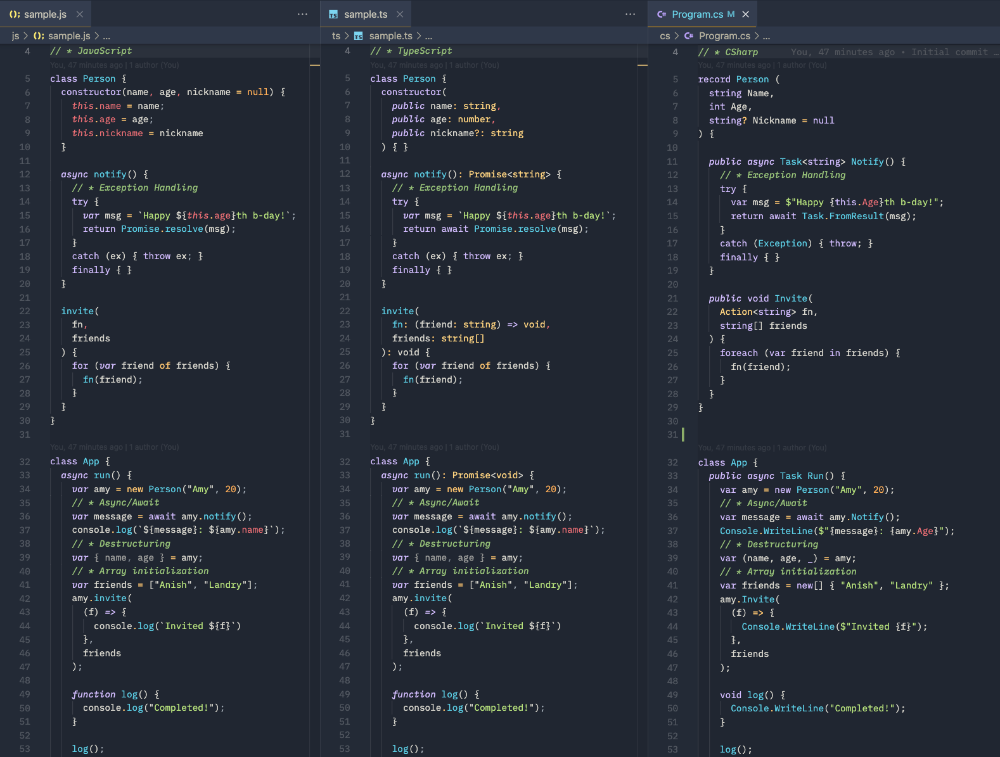

# Intro and Motivation

Many teams find themselves outgrowing Node.js and TypeScript ***on the backend*** when building systems of consequence.  In particular, TypeScript helps at dev and build time, but of course it's just JavaScript at runtime with all of its pitfalls and potential issues due to the lack of a strong static type system.

If we look at the lifecycle of a codebase from dev-to-build-to-runtime, the problem becomes clear:

|Lifecycle|TypeScript|C#|
|--|--|--|
|**Dev**|Types present and help developers determine correctness|Ditto!|
|**Build**|Types inspected across the codebase to ensure correctness of the application as the codebase is transformed into JavaScript which is what is actually shipped out.|C# is compiled into an [intermediate language (IL)](https://learn.microsoft.com/en-us/dotnet/standard/managed-code#intermediate-language--execution) or native binary (via [ahead of time compilation (AOT)](https://learn.microsoft.com/en-us/dotnet/core/deploying/native-aot/?tabs=windows%2Cnet8)) that runs on the .NET runtime.|
|**Runtime**|*Types no longer present* 😱 to enforce correctness of data so another mechanism is needed (schema validation) to ensure correctness and guard against invalid data from sneaking in. [Zod](https://zod.dev), [Valibot](https://valibot.dev), or other schema validators are necessary.|Type metadata still present and enforced at runtime 💪!  Runtime errors happen when there's a type mismatch at a boundary (typically serialization).  The difference is that this is "free" as a JSON payload is transformed into managed C# objects.|

::: info Should you use C# for web front-ends?
We're only considering backends here; I do not think that .NET-based front-ends (e.g. Blazor) are competitive in all use cases.
:::

Teams will often consider alternatives such as:

- Go
- Java
- Kotlin
- Scala
- Rust (?!?)

But many teams end up overlooking .NET and C#. Some teams may even have an inherent bias against C# because of its "Micro$oft" roots *while fully embracing other Microsoft products like GitHub, TypeScript, and VS Code!* (the irony)

In fact, C# is probably the most natural choice for teams that are already adept at TypeScript because the languages share so much in common.  Both TypeScript and C# are designed by [Anders Hejlsberg](https://en.wikipedia.org/wiki/Anders_Hejlsberg) of Microsoft.  Because of this lineage and the long influence of C# on JavaScript and vice versa, C# and TypeScript have actually been converging over the last decade.

Many developers, engineering managers, and CTOs may have come across C# and .***NET Framework*** at some point in their career, but haven't looked at it since Microsoft pivoted to the open source ***.NET Core*** initiative (that yielded the open source, numbered .NET versions).  Today's .NET is very different from *.NET Framework* of the 2000's.  Let's start with a simple distinction:

- `.NET Framework` - Win32 bindings, legacy, and primarily maintained and supported for legacy enterprise use cases.  You'll see this as `.NET Framework 4.8.x`
- `.NET 5`, `.NET 6`, `.NET 7`, `.NET 8`, `.NET 9`, etc - Modern, cross-platform .NET that runs on Linux, macOS, and Windows with x64 or Arm64 targets.
- `.NET Core`, `.NET Standard` - Designator of the bifurcation point between legacy and modern (long legacy of terrible nomenclature from Microsoft...)

::: info What's in a name?
I often wonder if Microsoft would have been better off just calling it `dot` instead when they made the transition from .NET Framework...
:::



## The Problem with TS

Don't get me wrong: for working with JavaScript, TypeScript is an absolute necessity once a project grows beyond a toy and every JavaScript project I work on is TypeScript (e.g. [CodeRev.app](https://coderev.app)).  Every JavaScript project that isn't a library should be written in TypeScript.

The fundamental problem with TypeScript-based backends and APIs is that this API:

```ts{13}
export class CreateCatDto {
  name: string;
  breed: string;
}

export class CreateDogDto {
  name: string;
  breed: string;
  bark: "loud" | "medium" | "quiet"
}

// Nest.js controller, but could also be Express.js handler
@Post()
async create(@Body() createCatDto: CreateCatDto) {
  // Add a cat to the database
}
```

Will *happily* accept this payload at runtime:

```ts
{
  name: "Poochie",
  breed: "Chihuahua",
  bark: "loud" // [!code warning]
}
```

It will also accept this:

```ts
{
  name: "Poochie",
  breed: "Chihuahua",
  bark: "eW91IHByb2JhYmx5IGRvbid0IHdhbnQgdGhpcyB1bnNhZmUgYW5kIG1hbGljaW91cyBwYXlsb2FkIGluIHlvdXIgZGF0YWJhc2UuLi4=" // [!code error]
}
```

And now the `createCatDto` is carrying an extra `bark` property of dubious content because JavaScript doesn't care!  *TypeScript's type safety means nothing at runtime.*

That's because the type information no longer exists at runtime and there's no enforcement of type which requires adding schema validators like [Zod](https://zod.dev/) or [Valibot](https://valibot.dev/) to actually check the incoming payload conforms to some shape.  ***Extra work.***  (In fact, you might be here exactly because you're fed up with this extra work to ensure the correctness and safety of your backend application!)

This problem is actually quite common and often rears its head as *the round-trip problem*.  This happens when you *read* a model with additional properties (e.g. via a Prisma includes) and then try to *write* the model back with a more narrow model that doesn't carry the includes: the more narrow shape will accept the wider shape!

What if you write this to a document-oriented database without checking the schema?  What if you serialize it to `jsonb` and store it in Postgres?  What if your ORM tries to map and persist this?

At best, you may not notice the payload and it's entirely harmless.  At worst, the payload can contain *anything*.

Of course, you can add a third party package to ensure adherence to a known schema or even write the code yourself.  But this feels like really basic *table stakes* for building a backend API where you care about your data; why is there a dependency on third parties and why would you build this yourself?

## Why C#

### It's Easy to Learn

Throughout this guide, you'll notice just how similar TypeScript and C# are because of their shared designer.  This makes C# one of the easier languages to learn compared to Go or Scala if you already now TypeScript.  I don't think it's a coincidence that C# is used in game engines like [Unity](https://unity.com/how-to/programming-unity) and [Godot](https://docs.godotengine.org/en/stable/tutorials/scripting/c_sharp/index.html); it offers the right amount of structure vs DX/ergonomics vs ease of adoption to make it broadly appealing.

### Strongly Typed Yet *Flexible*

It turns out that -- if you are doing anything of consequence -- you actually probably want to have strong, static types on your backend because this will help reduce mistakes and errors while also reducing verbosity in the overall codebase required in JS to ensure some level of type safety (e.g. Zod schemas).

But .NET has a few interesting tricks up its sleeve when it comes to types such as:

- Type inference
- Tuples
- Named tuples
- Anonymous types
- Type extensions
- Union types (via 3rd party extensions [for now...](https://github.com/dotnet/csharplang/blob/main/proposals/TypeUnions.md))

Read more in the section on [classes and types](./basics/classes.md)

### Balance of Runtime Performance + Great DX

- C# is not as fast and memory efficient as Rust
- Because it's JIT, it compiles to larger binaries than Go
- It also means it starts up slower than JavaScript

But for all of that, .NET still performs extremely well across the board in a variety of applications and with [ahead-of-time compilation (AOT)](https://learn.microsoft.com/en-us/dotnet/core/deploying/native-aot/?tabs=windows%2Cnet8), it is possible to achieve relatively fast startup times.


For backends, .NET offers high performance roughly in the same ballpark with Java and Go with an excellent DX because of the large standard library and first party packages from Microsoft ("batteries included") as well as hot-reload (see [CLI and Tooling](./basics/cli-tooling.md)).

### Tooling

.NET offers great tooling support in VS Code (free) and Rider (free personal, paid commercial) and is supported on Linux, macOS, and of course Windows.  It supports targeting both x64 and Arm64 architectures.

The [dotnet cli](https://learn.microsoft.com/en-us/dotnet/core/tools/) is easy to use as well.

Read more in [the next section on getting started](./getting-started.md).

### Documentation

Microsoft's [excellent documentation](https://learn.microsoft.com/en-us/dotnet/csharp/language-reference/) is cohesive and thorough, making it easy to read and understand.  In Node, you might read documentation across a variety of third party sites for different packages (Zod, Prisma, Nest.js) which have different levels of thoroughness, different navigation, different writing styles, and so on.  .NET's large standard library means that much of it also has consistent first party documentation.

Perhaps more importantly, it means that you'll likely get better results with LLMs because of the high quality documentation.

### Security

JavaScript's lack of a deep and broad standard library means that a lot of functionality depends on third parties.  On the other hand, .NET's large first party ecosystem means that if there are security issues, they will get patched.  With third party libraries in either .NET or Node.js, this can be a roll of the dice!

Historically, NPM has also been a known vector for supply chain attacks and JavaScript's nature as a dynamic language means that it is susceptible to types of attacks that are not possible in a .NET runtime.


Check out [GitHub's 2020 State of the Octoverse Security report for more insights](https://octoverse.github.com/2020/).

### Mature but Constantly Evolving

C# and .NET are constantly evolving and the language consistently improves DX with each release, reducing the verbosity of the language.  It's akin to the relationship between Kotlin and Java on the JVM, except C# has continued to rapidly evolve as a language.

Check out some of the latest releases:

- [C# 13](https://learn.microsoft.com/en-us/dotnet/csharp/whats-new/csharp-13)
- [C# 12](https://learn.microsoft.com/en-us/dotnet/csharp/whats-new/csharp-12)
- [C# 11](https://learn.microsoft.com/en-us/dotnet/csharp/whats-new/csharp-11)
- [C# 10](https://learn.microsoft.com/en-us/dotnet/csharp/whats-new/csharp-10)

What should be clear is how much of a focus the .NET team has a ergonomics and DX.

## Common Myths

### Myth: C# Requires Visual Studio and Expensive Licenses

This is not the case; in fact C# works great from VS Code!  It's completely free to use and you can use the C# extensions without a license.

### Myth: .NET is Windows Only

This was true of .NET Framework which had bindings to the Win32 dlls.  Since .NET Core, Microsoft has been making .NET truly cross platform and any of the "numbered versions" like .NET 6, 7, 8, 9 can all run on Linux, macOS, and Windows.

In fact, at one startup, we developed .NET on M1 MacBook Pros, built our containers in GitHub Actions, and deployed those in AWS on Arm64 `t4g` instances.

.NET is a great cross-platform backend.

### Myth: .NET is a Legacy Platform

This is true of ***.NET Framework***, but the numbered .NET versions (.NET 6, 7, 8, 9) are modern and the underlying platform evolves extremely fast and is perhaps more akin to Kotlin in that sense.

### Myth: .NET is Hard to Learn

That's why this doc exists 😅 In fact, .NET's congruence with TypeScript means that developers that know JavaScript and TypeScript should be able to easily transition to C#.  In fact, I would argue that C# is probably *easier* to learn because of the more strict type system.

### Myth: .NET Web APIs are Complicated

If you are building an enterprise system, you are probably going to choose Nest.js.  At that point, you are writing controller classes, using decorators, and utilizing dependency injection -- exactly the same as if you were using .NET Web APIs.  Except in Node.js, you don't get the benefits of the type system at runtime and throughput of a multi-threaded runtime.

### Myth: .NET's Performance Over Node.js Doesn't Matter

Performance is probably the wrong way to think about the delta between something like .NET versus Node.js; it's probably better to think of it as *throughput*.  Given a certain amount of hardware spend, .NET will yield a *higher request throughput* compared to Node.js solutions.  This equates to less infra spend as you scale up and *this* can be significant.

### Myth: C# is for Enterprises

While it's true that C# is an excellent choice in the enterprise, it's also used in game engines like [Unity](https://unity.com/how-to/programming-unity) and [Godot](https://docs.godotengine.org/en/stable/tutorials/scripting/c_sharp/index.html).  This myth may have roots in the reality that early on in ***.NET Framework's*** life, the only tooling available was enterprise licenses for Visual Studio.  The modern .NET tooling in VS Code and Rider makes working with C# free and a really great experience whether you're an indie developer, small startup, mid-size business, or enterprise scale!
